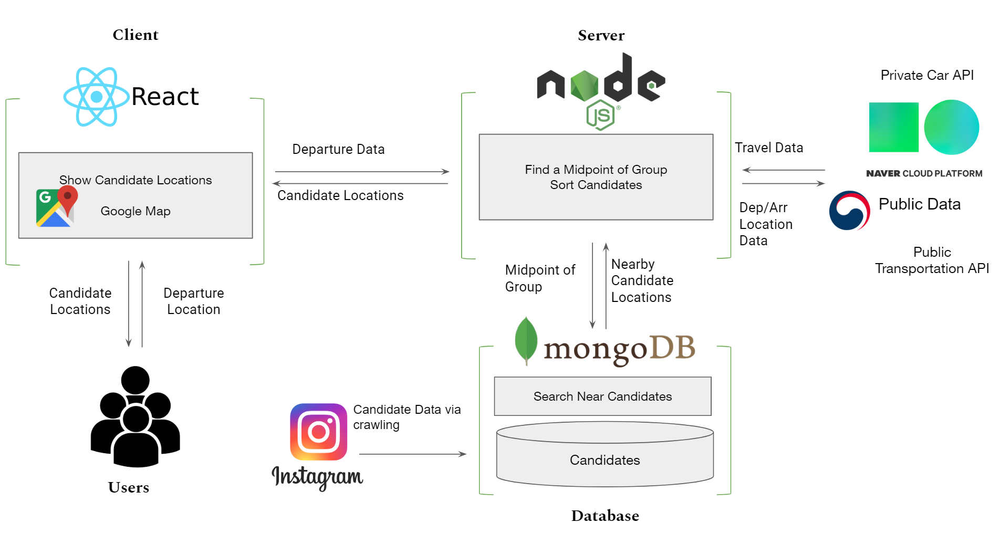

# ㅁㄷㅁㅇ

## Goal

다수의 모임에서 만남의 장소를 정하는 것은 쉽지 않다. 모임의 위치, 목적, 살고 있는 곳 등 다양한 요인이 복합적으로 작용하기 때문이다. 이러한 상황에서 우리는 모임 구성원의 지역과 모임의 특성을 파악해서 최적의 장소를 모색해주고자 한다.

It is not easy to find a meeting place for a large group due to the various factors such as the location, purpose of meeting and residence of members. We aim to provide optimal places by identifying the location of group members and the characteristic of the group. This provides users with optimal places that they can easily find.

## System Architecture

## Team

v2: 최성훈, 강인호, 곽태영, 신영환, 장진형

v3: 곽태영(GraphQL 추가), 신영환(안드로이드 앱 개발)

## Usage

1. '모임 만들기' 버튼을 클릭하여 모임 생성

    Provide information and click the 'Create Meeting' button to get started.

2. '모임'페이지를 다른 사용자들에게 공유

    Share the Meeting with others.

3. 모임 구성원들이 '모임'페이지에 출발지 정보를 입력

    Each participant enters the starting point information.

4. '결과보기'버튼을 클릭하여 합리적인 모임장소 리스트를 추천 받기

    Get recommended place list by clicking 'Result' button.

5. 각각의 모임 장소를 클릭하여 경로 및 장소의 관한 정보를 확인

    Click on each meeting place to find information about the direction and location.

6. 마음에 드는 장소에 투표

    Vote where you want!

## Demo
[Link](https://www.youtube.com/watch?v=iy-3Q11D7dg&feature=youtu.be)
